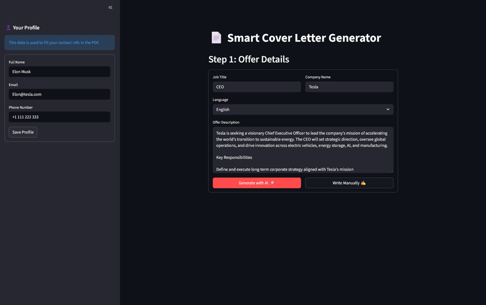
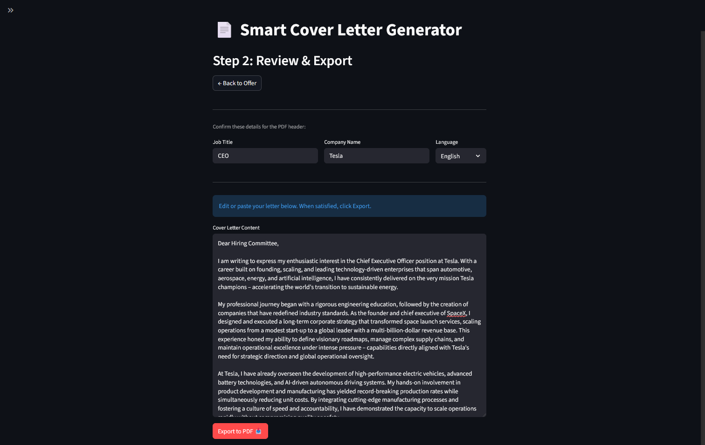
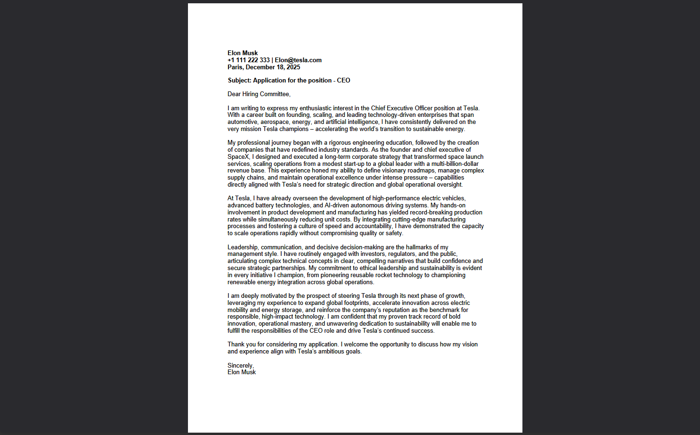

# 📄 Smart Cover Letter Generator

A powerful, interactive application that generates custom cover letters using AI (Groq Openai/gpt-oss-120b) and exports them to PDF using your own Word templates.

The app features a **Streamlit Frontend** for easy interaction and a **FastAPI Backend** for handling business logic and file generation.

---

## 🚀 Features

-   **AI Generation:** Uses Groq (openai/gpt-oss-120b) to write tailored letters based on your resume and the job description.
-   **Dual Mode:** Choose between "Generate with AI" or "Write Manually" (bypass AI to just use the PDF exporter).
-   **PDF Export:** Automatically fills a `.docx` template and converts it to PDF using LibreOffice.
-   **Profile Management:** Save your contact details (Name, Email, Phone) in the sidebar so you don't have to re-type them.
-   **Multi-Language:** Supports English and French templates.

---

## 📸 Screenshots

### 1. Input Details & AI Generation

The main dashboard where you enter job details or choose to write manually.


### 2. Review & Personalization

Review the generated letter, make manual edits, and confirm your contact details before exporting.


### 3. Final PDF Output

The result: a clean, professionally formatted PDF generated from your Word template.


---

## 🛠️ Prerequisites

Before running the app, ensure you have the following installed:

1.  **Python 3.9+** (Anaconda recommended)
2.  **LibreOffice** (Required for converting Word docs to PDF).
    -   _Windows:_ Install standard LibreOffice. Ensure `soffice` is in your system PATH or accessible.
    -   _Linux/Mac:_ `sudo apt install libreoffice` / `brew install libreoffice`.
3.  **Groq API Key**: Get a free key at [console.groq.com](https://console.groq.com/).

---

## ⚙️ Installation & Setup

### 1. Clone/Download

Download this project to your local machine.

### 2. Install Dependencies

It is recommended to use a Conda environment.

```bash
# Create and activate environment
conda create -n cover-letter-env python=3.10
conda activate cover-letter-env

# Install requirements
pip install -r backend/requirements.txt
pip install -r frontend/requirements.txt

```

### 3. Configure API Key

1. Navigate to the `backend/` folder.
2. Create a file named `.env`.
3. Add your Groq API key inside:

```env
GROQ_API_KEY=your_actual_api_key_here

```

---

## 📝 **CRITICAL: Personalize Your AI**

For the AI to write a letter that sounds like **you** and references **your experience**, you must edit the prompt file.

1. Go to **`backend/files/cover_letter_prompt.txt`**.
2. Open the file in any text editor.
3. Copy the text from your **Resume/CV** and paste it into the designated section of the prompt file.
4. _(Optional)_ You can also paste a sample of a previous cover letter you wrote so the AI mimics your writing style.

**Example `cover_letter_prompt.txt` structure:**

```text
You are an expert copywriter helping me write a cover letter.
[... existing rules ...]

My cv:

[Paste CV content here]

```

---

## 🎨 Customizing Templates

The app uses Microsoft Word (`.docx`) files as templates. You can design them however you like (fonts, logos, layout), as long as you keep the specific placeholders.

Files are located in: `backend/files/`

-   `template_en.docx` (English)
-   `template_fr.docx` (French)

**Required Placeholders:**
Ensure your Word documents contain these exact text strings so the app can replace them:

-   `{{DATE}}` - Inserts today's date
-   `{{TITLE}}` - Inserts the Job Title
-   `{{BODY}}` - Inserts the main letter content
-   `{{MY_NAME}}` - Inserts your name (from Sidebar)
-   `{{MY_EMAIL}}` - Inserts your email (from Sidebar)
-   `{{MY_PHONE}}` - Inserts your phone (from Sidebar)

---

## ▶️ How to Run

### Option A: One-Click (Windows)

1. Open the `run_app.bat` file in a text editor.
2. Change `SET CONDA_ENV_NAME=YOUR_ENV_NAME` to your actual environment name (e.g., `cover-letter-env`).
3. Double-click `run_app.bat`.

### Option B: Manual (Terminal)

You will need two terminal windows.

**Terminal 1 (Backend):**

```bash
conda activate cover-letter-env
uvicorn backend.main:app --reload --port 8000

```

**Terminal 2 (Frontend):**

```bash
conda activate cover-letter-env
streamlit run frontend/app.py

```

---

## 📂 Project Structure

```text
ai-cover-letter-generator/
├── assets/                   # <--- Screenshots for README
│   ├── tab1_input.png
│   ├── tab2_review.png
│   └── pdf_example.png
├── backend/
│   ├── files/                # <--- EDIT PROMPTS & TEMPLATES HERE
│   │   ├── cover_letter_prompt.txt
│   │   ├── template_en.docx
│   │   └── template_fr.docx
│   ├── services/             # Logic for LLM and PDF generation
│   ├── main.py               # FastAPI server
│   ├── config.py             # Settings loader
│   ├── .env                  # API Keys (Groq)
│   └── requirements.txt
├── frontend/
│   ├── app.py                # Streamlit UI
│   └── requirements.txt
├── .gitignore
├── README.md                 # Instructions for setup & prompt editing
├── run_app.bat               # Windows launcher script
└── user_profile.json         # Auto-generated file (stores name/email/phone)

```
